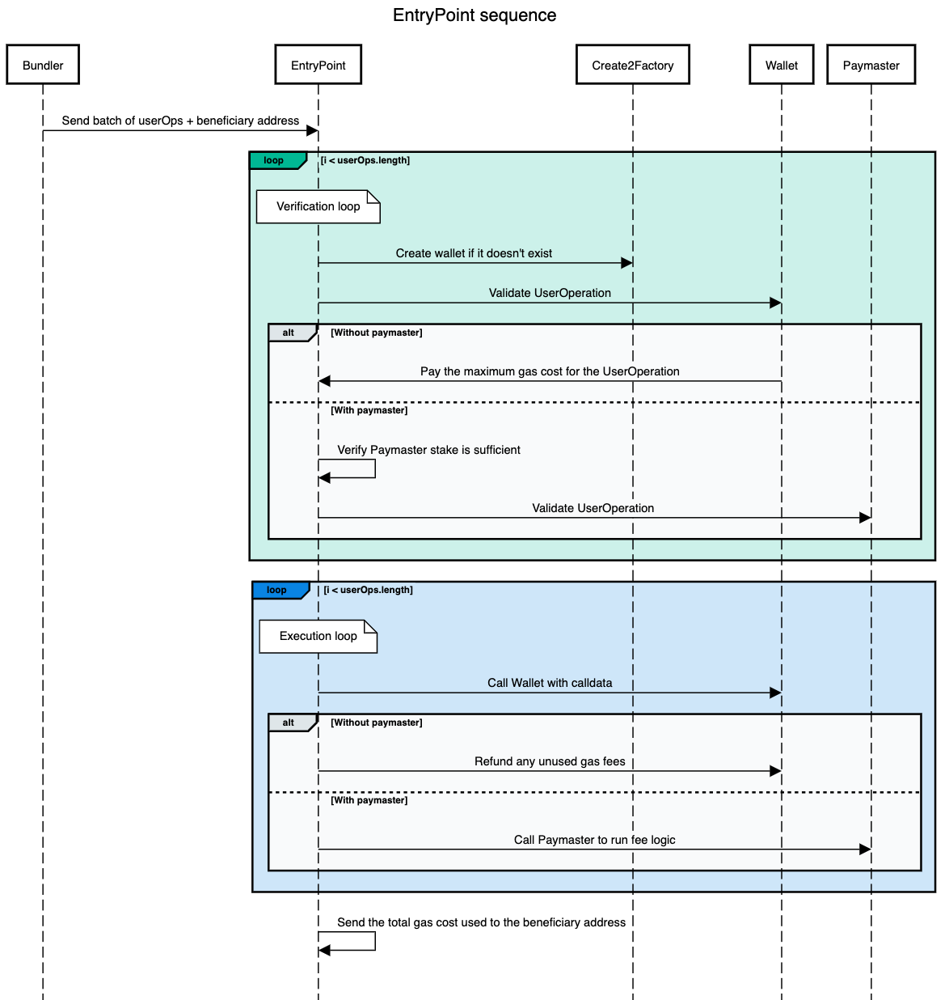

# ERC-4337 Overview

A quick overview of the standard for developers.

:::info

This overview does not yet cover the `Aggregator`. The latest addition to the EIP to support aggregated signatures.

:::

## Introduction

This page gives a simplified overview of ERC-4337 so that developers can get a basic understanding of the different components and how they can be pieced together to build their applications. **For a full run down on the spec we recommend going straight to the [source](https://eips.ethereum.org/EIPS/eip-4337).**

## UserOperation

All components of ERC-4337 revolve around a pseudo-transaction object called a `UserOperation` which is **used to execute actions through a smart contract wallet**. This isn't to be mistaken for a regular transaction type.

| Field                  | Type      | Description                                                                   |
| ---------------------- | --------- | ----------------------------------------------------------------------------- |
| `sender`               | `address` | The address of the smart contract wallet                                      |
| `nonce`                | `uint256` | Anti-replay protection                                                        |
| `initCode`             | `bytes`   | Code used to deploy the wallet if not yet on-chain                            |
| `callData`             | `bytes`   | Data that's passed to the `sender` for execution                              |
| `callGasLimit`         | `uint256` | Gas limit for execution phase                                                 |
| `verificationGasLimit` | `uint256` | Gas limit for verification phase                                              |
| `preVerificationGas`   | `uint256` | Gas to compensate the bundler                                                 |
| `maxFeePerGas`         | `uint256` | Similar to EIP-1559 max fee                                                   |
| `maxPriorityFeePerGas` | `uint256` | Similar to EIP-1559 priority fee                                              |
| `paymasterAndData`     | `bytes`   | Paymaster address and any extra data required for verification and execution  |
| `signature`            | `bytes`   | Used to validate a `UserOperation` along with the `nonce` during verification |

## Architecture

Although highly simplified, the above diagram shows the interactions between all the different components of the standard. We'll get into details of each component below, but on a high level a `UserOperation` has the following life cycle.

1. A `UserOperation` is created in your app and signed by the user.
2. The `UserOperation` is sent to a dedicated mempool.
3. A `Bundler` batches multiple `UserOperations` from the mempool and relays them to the `EntryPoint`.
4. The `EntryPoint` coordinates the verification and execution of the `UserOperation` via the `Wallet` and `Paymaster`.

### Bundler

A `Bundler` is a class of actors that can do several things:

- Listen in to a `UserOperation` mempool.
- Runs simulations.
- Bundles an array of operations.
- Relays bundles to the `EntryPoint`.

:::note

The dedicated `UserOperation` mempool is separate and not to be confused with the regular transaction mempool.

:::

:::info

Although a public P2P `UserOperation` mempool is still a work in progress, the advantages of account abstraction can still be leveraged today by relying on private mempools that anyone can spin up.

:::

### EntryPoint

The `EntryPoint` is a contract that acts as a central entity for all ERC-4337 wallets and paymasters. It coordinates the verification and execution of a `UserOperation`. For this reason, it's important for all implementations of an `EntryPoint` to be audited and not controllable by any single entity.

The above sequence diagram shows how the `EntryPoint` handles a batch of `UserOperations` sent by the `Bundler`. Essentially there are 2 phases.

1. **Verification loop**: Verifies that each `UserOperation` is valid by checking it with both the `Wallet` and the `Paymaster`.
2. **Execution loop**: Sends the `callData` in each `UserOperation` to the `Wallet`.

The verification loop will also make sure that either the `Wallet` or `Paymaster` can pay the maximum gas cost for each `UserOperation`. In the execution loop any unused gas fee is refunded to the `Wallet` or a function is called on the `Paymaster` to run any required fee logic.

:::info

`Create2Factory` refers to [EIP-2470: Singleton Factory](https://eips.ethereum.org/EIPS/eip-2470). This is a permission-less contract used to deploy `Wallets` with the same deterministic address on any chain.

:::

### Wallet

The `Wallet` is a user's `Contract Account`. At minimum it needs to check whether or not it will accept a `UserOperation` during the verification loop.

Additional features to support other wallet functions like social recovery and multi-operations can be added here too.

### Paymaster

The `Paymaster` is another `Contract Account` that handles any `UserOperation` with sponsored transactions. It is required to do 2 things:

1. Check whether or not it will accept a `UserOperation` during the verification loop.
2. Run any required fee logic in the execution loop.

An example of a `Paymaster` logic could be to withdraw a certain amount of ERC-20 tokens from the `Wallet` after the `UserOperation` is executed. This allows for a UX where users can pay for gas in any currency they choose.
